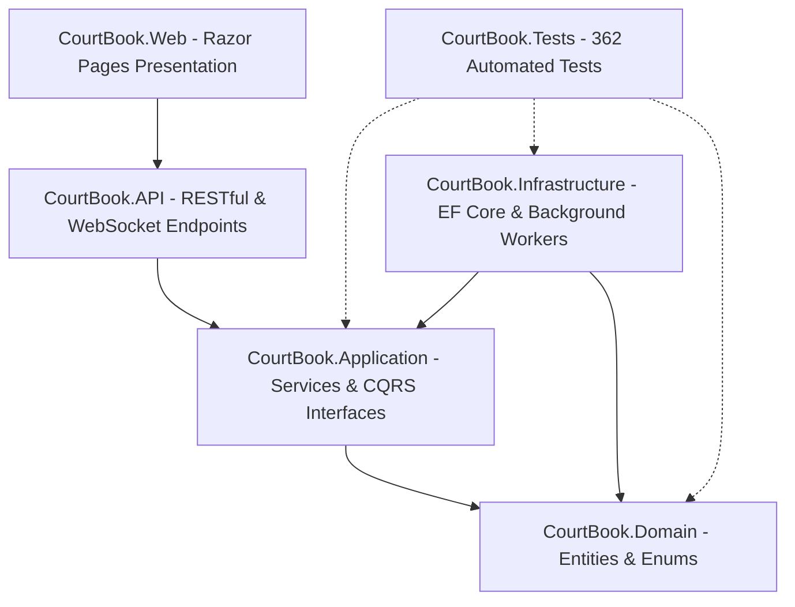

# PlaySpot (CourtBook) — Enterprise Sports Venue & Court Booking Platform

[](https://dotnet.microsoft.com/)
[](https://docs.microsoft.com/dotnet/csharp/)
[](https://docs.microsoft.com/ef/core/)
[](tests/CourtBook.Tests)
[](src/)
[%20%7C%20English%20(LTR)-orange?style=flat-square)](src/CourtBook.Web)
[](LICENSE)

> **PlaySpot** (developed under the core engineering moniker `CourtBook`) is an enterprise-grade sports venue discovery, court reservation, and facility operations management platform. Built specifically for high-demand athletic ecosystems—supporting **Football**, **Padel**, **Tennis**, **Basketball**, and **Volleyball**—PlaySpot combines atomic double-booking prevention, real-time slot telemetry, digital payment processing (Paymob), automated receptionist check-in, owner revenue settlement, and full bilingual localization (Arabic RTL & English LTR).

---

## 🌟 Live Portfolio Showcase
PlaySpot is featured as the flagship enterprise full-stack system in Mohamed Elhadad's Developer Portfolio:
🔗 **[View Mohamed Elhadad's Portfolio](https://foxelhadad812-design.github.io/portfolio/)**

> [!NOTE]
> **Repository vs. Static Hosting:** GitHub Pages only hosts static HTML/JS files (such as portfolio sites). PlaySpot is a full-stack, enterprise-grade ASP.NET Core 10 system requiring relational persistence (SQL Server), background workers, real-time WebSockets (SignalR), and secure API endpoints. Production deployments utilize Docker containers on Linux/Cloud VM infrastructure behind an NGINX reverse proxy.

---

## 🏛 System Architecture

The solution strictly adheres to **Clean Architecture** (Onion Architecture) principles and domain-driven separation of concerns. Dependencies flow inwards toward domain entities.



### Layer Breakdown

| Project Layer | Role & Responsibility | Key Components |
|---|---|---|
| **`CourtBook.Domain`** | Enterprise Core | Domain entities (`User`, `Venue`, `Court`, `Booking`, `Payment`, `Review`, `PromoCode`, `EquipmentAddon`), pure domain rules, enums. Zero external dependencies. |
| **`CourtBook.Application`** | Application Business Logic | Service contracts, business validations, DTO mappings, pricing calculators, slot generator algorithms, and concurrency lock contracts. |
| **`CourtBook.Infrastructure`** | Persistence & Adapters | EF Core `ApplicationDbContext`, SQL Server application lock provider (`sp_getapplock`), migrations, background hosted services (`PaymentHoldWorker`, `SettlementWorker`), Paymob gateway client. |
| **`CourtBook.API`** | Headless API & Gateway | RESTful controllers, JWT bearer authentication, SignalR hub (`/hubs/booking`), Swagger/OpenAPI documentation, health check probes (`/health`, `/health/details`), rate limiting. |
| **`CourtBook.Web`** | PlaySpot User Experience | ASP.NET Core Razor Pages, Cookie-based session token handler, Bootstrap 5 responsive UI, bilingual RTL/LTR dynamic styling, SweetAlert2 alerts, client-side slot grid. |
| **`CourtBook.Tests`** | Test Suite | 362 automated unit and integration tests verifying concurrency, financial integrity, access control, and operational workflows. |

---

## 🚀 Key Functional Capabilities (Phases 1–12)

### 1. Atomic Booking Engine & Concurrency Control
- **Database-Level Application Locks (`sp_getapplock`):** Guaranteed serialized access for overlapping time-slot requests on the same court. Prevents double-booking even under intense concurrent load.
- **Temporary Payment Holds:** Unpaid online bookings are held for a configurable window (10 minutes) before automatic release back to the availability pool by the background `PaymentHoldWorker`.
- **Slot Availability Engine:** Real-time dynamic generation of available slots taking into account opening hours, court maintenance status, active holds, and confirmed reservations.

### 2. Commercial & Operational Tooling (Phase 12)
- **Promo Codes & Discount Engine:** Percentage and fixed-amount discounts with expiration dates, maximum usage caps, and per-user redemption validation.
- **Equipment Rental Add-ons:** Seamlessly add rackets, balls, bibs, and lighting fees directly to the reservation with automatic itemized invoice calculation.
- **Receptionist Front-Desk Check-in:** Front-desk staff can instantly verify player arrivals via 6-digit confirmation code or QR reference, updating reservation status to `Attended`.
- **Owner Manual Phone Booking:** Venue owners and desk managers can record direct walk-in or phone reservations with custom customer details without requiring online payment gateway steps.
- **Direct WhatsApp Booking Sharing:** One-click pre-formatted Arabic/English reservation details sharing via WhatsApp Web and WhatsApp Mobile deep links.

### 3. Financial Engine & Payment Processing
- **Paymob Payment Gateway:** Support for card payments, mobile wallets (Vodafone Cash, Orange Money, etc.), and reference codes with cryptographic HMAC webhook validation.
- **Cash / On-Site Settlement:** Optional on-site payment method with strict receptionist and owner tracking.
- **Platform Commission & Payout Worker:** Automated background settlement calculation (`SettlementWorker`) segregating platform commission from venue owner net balances.

### 4. Multi-Role Portals & Role-Based Access Control (RBAC)
- 🏃 **Player Portal:** Browse venues, filter by sport/amenities/city, book slots, apply promo codes, review past bookings, rate attended sessions, and download receipts.
- 🏟️ **Venue Owner Portal:** Multi-venue and court management, schedule configuration, pricing tiers, manual phone booking creation, and revenue/payout analytics.
- 📋 **Receptionist Portal:** Front-desk verification terminal, arrival check-in validation, and daily schedule timeline view.
- 🛡️ **Super Admin Portal:** Platform-wide oversight, user management, venue approval workflows, dispute resolution, and commission configuration.

### 5. Native Bilingual Experience (Arabic & English)
- Complete bi-directional design with full support for Arabic (RTL - Right to Left) and English (LTR - Left to Right).
- Cairo typography for modern Arabic legibility paired with Inter for English.
- Instant, non-reloading language switching preserving session state and filter criteria.

---

## 🛠 Tech Stack Matrix

| Area | Technology / Library | Version | Usage |
|---|---|---|---|
| **Framework** | .NET | 10.0 | High-performance modern web framework |
| **Language** | C# | 13.0 | Pattern matching, records, primary constructors |
| **ORM** | Entity Framework Core | 10.0 | Code-First migrations, optimized LINQ queries |
| **Database** | Microsoft SQL Server | 2019+ | Relational data, ACID transactions, `sp_getapplock` |
| **Real-Time** | ASP.NET Core SignalR | 10.0 | Instant court slot status broadcasting over WebSockets |
| **Authentication** | ASP.NET Core Identity & JWT | 10.0 | JWT tokens for API, secure cookie sessions for Web UI |
| **Frontend UI** | Razor Pages & Bootstrap | 5.3 | Responsive grid, custom CSS variables, RTL stylesheet |
| **Components** | SweetAlert2 & FontAwesome | 11 / 6.5 | Accessible modals, interactive alerts, and sports iconography |
| **Payments** | Paymob Payment API | v1 / HMAC | Credit cards, mobile wallets, and webhook listener |
| **Testing** | xUnit & Moq & In-Memory / SQLite | 2.9+ | 362 automated unit and integration tests |
| **Containerization** | Docker & Docker Compose | Multi-stage | Alpine/Debian slim runtime images for Web and API |
| **Reverse Proxy** | NGINX | Alpine | SSL termination, header forwarding, static asset caching |

---

## 📂 Project Directory Structure

```
CourtBook/
├── src/
│   ├── CourtBook.Domain/               # Pure domain models, enums, domain rules
│   │   ├── Entities/                   # Venue, Court, Booking, Payment, Review, PromoCode, etc.
│   │   └── Enums/                      # SportType, BookingStatus, PaymentStatus, UserRole
│   ├── CourtBook.Application/          # Use cases, interfaces, DTOs, validations
│   │   ├── Common/                     # Interfaces (IApplicationDbContext, ICurrentUserService)
│   │   ├── DTOs/                       # Strongly-typed data transfer objects
│   │   └── Services/                   # BookingService, AvailabilityService, PromoCodeService
│   ├── CourtBook.Infrastructure/       # Data persistence, external service implementations
│   │   ├── BackgroundServices/         # PaymentHoldWorker, SettlementWorker
│   │   ├── Common/                     # Distributed lock provider, time providers
│   │   ├── Migrations/                 # EF Core SQL Server migrations history
│   │   ├── Persistence/                # ApplicationDbContext, entity configurations
│   │   └── Services/                   # PaymobGatewayService, EmailService, SmsService
│   ├── CourtBook.API/                  # REST API controllers & OpenAPI specifications
│   │   ├── Controllers/                # Auth, Venues, Courts, Bookings, Payments, Admin
│   │   ├── Hubs/                       # BookingHub (SignalR real-time court availability)
│   │   └── Program.cs                  # Dependency injection, middleware pipeline, health checks
│   └── CourtBook.Web/                  # PlaySpot Razor Pages customer and owner application
│       ├── Middleware/                 # SessionTokenHandler, AuthMiddleware
│       ├── Pages/                      # Player, Owner, Receptionist, Admin Razor Pages
│       ├── Services/                   # Typed ApiClient, LocalizationService
│       └── wwwroot/                    # CSS (LTR & RTL), JS, sports imagery assets
├── tests/
│   └── CourtBook.Tests/                # 362 unit, integration, and concurrency tests
├── docs/                               # Architecture blueprints, security reviews, deployment guides
├── Dockerfile.api                      # Multi-stage production build for API
├── Dockerfile.web                      # Multi-stage production build for Web portal
├── docker-compose.staging.yml          # Containerized orchestration with SQL Server and NGINX
├── DEPLOYMENT.md                       # Comprehensive deployment runbook
└── CourtBook.slnx                      # Modern solution definition
```

---

## 🚦 Getting Started & Local Development

### Prerequisites
- [.NET 10 SDK](https://dotnet.microsoft.com/download/dotnet/10.0)
- [Microsoft SQL Server](https://www.microsoft.com/sql-server) (LocalDB, Express, or Developer edition)
- (Optional) [Docker Desktop](https://www.docker.com/) for containerized execution

### 1. Clone the Repository
```bash
git clone https://github.com/foxelhadad812-design/CourtBook.git
cd CourtBook
```

### 2. Configure Database Connection
Copy or configure your local database connection string in `src/CourtBook.API/appsettings.Development.json` (or set the environment variable `ConnectionStrings__DefaultConnection`):

```json
{
  "ConnectionStrings": {
    "DefaultConnection": "Server=localhost;Database=PlaySpotDB;Trusted_Connection=True;TrustServerCertificate=True;"
  }
}
```

### 3. Apply Database Migrations & Seed Data
Execute EF Core migrations to scaffold the database schema and default initial seed catalog:

```bash
dotnet ef database update \
  --project src/CourtBook.Infrastructure \
  --startup-project src/CourtBook.API
```

### 4. Run the Solution
In separate terminal sessions (or using your IDE's multi-project launch profile):

**Terminal 1 — Backend API:**
```bash
dotnet run --project src/CourtBook.API --launch-profile http
# API listening at http://localhost:5257 (Swagger at http://localhost:5257/swagger)
```

**Terminal 2 — PlaySpot Web Portal:**
```bash
dotnet run --project src/CourtBook.Web --launch-profile http
# Web Portal listening at http://localhost:5100
```

---

## 🧪 Automated Testing & Quality Assurance

The solution maintains a comprehensive automated testing suite encompassing unit tests, API integration tests, concurrency stress simulations, and financial integrity validations:

```bash
# Run all automated tests
dotnet test --nologo
```

```text
Passed!  - Failed: 0, Passed: 362, Skipped: 0, Total: 362, Duration: 10 s - CourtBook.Tests.dll (net10.0)
```

### Key Test Coverage Highlights:
- **`DoubleBookingConcurrencyTests`:** Simulates parallel booking requests on identical court slots to ensure `sp_getapplock` eliminates race conditions.
- **`FinancialIntegrityTests`:** Validates exact price calculation, promo code deduction formulas, equipment add-on sums, and platform commission math.
- **`AvailabilityEngineTests`:** Verifies dynamic slot generation across variable operating schedules, recurring holidays, and active booking states.
- **`Phase12CommercialAndOperationalTests`:** End-to-end verification of promo code usage limits, equipment rentals, manual phone bookings, and check-in workflows.

---

## 🌐 External Dependencies & Production Disclosure

To maintain full engineering transparency:
- **Paymob Payment Gateway:** The payment module interfaces with the Paymob v1 API. In local and staging environments, the system runs against Paymob's Sandbox or uses validated mock payment handlers. Production deployment requires active merchant credentials supplied via environment variables (`PaymentGateway__Paymob__ApiKey`, etc.).
- **Redis Cache & Backplane:** The solution includes optional Redis configuration for distributed caching and SignalR scale-out backplanes across multi-instance server farms. When running single-instance, in-memory caching and hubs operate seamlessly without requiring Redis.
- **Database Engine:** Production deployments require Microsoft SQL Server 2019+ or Azure SQL to support transactional application locking (`sp_getapplock`).

---

## 📄 License & Attribution

This project is licensed under the [MIT License](LICENSE).  
Venue and sports photography assets are curated under royalty-free licenses (Unsplash & Pexels). See [IMAGE_ATTRIBUTION.md](IMAGE_ATTRIBUTION.md) for full attribution details.

---

**Developed with precision by [Mohamed Elhadad](https://foxelhadad812-design.github.io/portfolio/)**  
*Enterprise Software Engineer & Full-Stack .NET Specialist*
