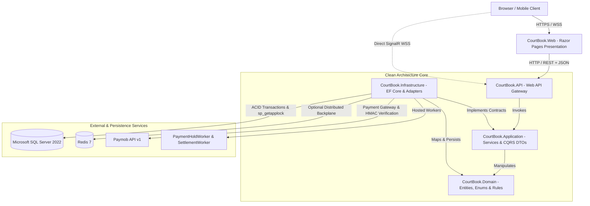
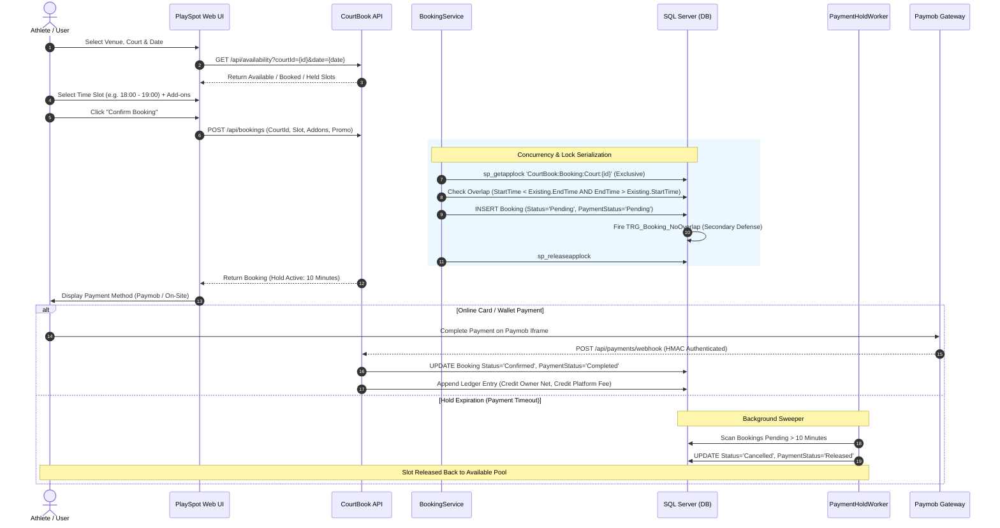
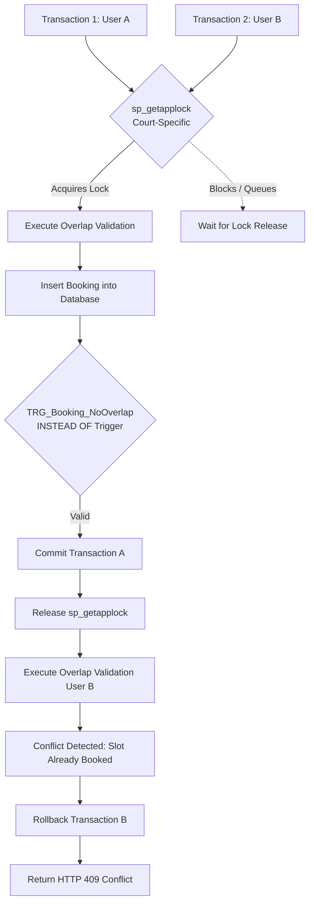
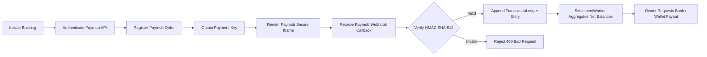
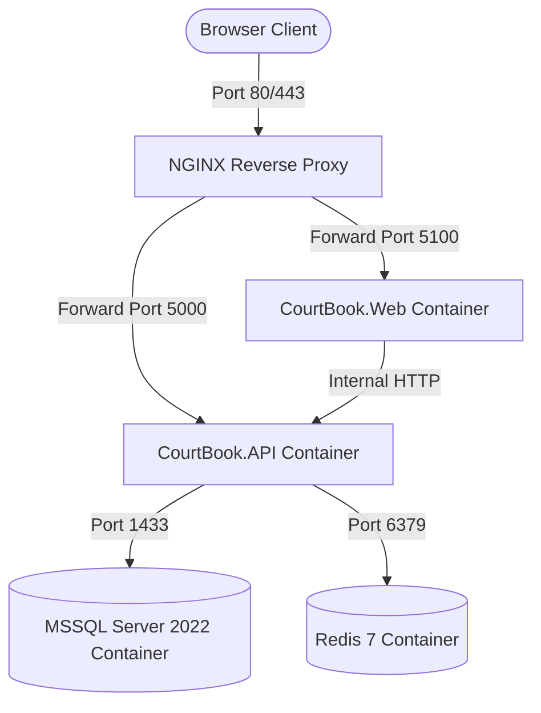

# PlaySpot (CourtBook) — Comprehensive Architectural Blueprint & Technical Reference Manual

> **Academic & Technical Evaluation Guide**  
> **Target Audience:** University Professors, Software Engineering Instructors, and System Evaluators  
> **System Name:** PlaySpot (Internal Moniker: `CourtBook`)  
> **Current Version:** Phase 12 (Commercial & Operational Enterprise Release)  
> **Repository Baseline:** `main` branch | Commit: `3822d98` | 15 Registered Migrations | 362 Automated Tests Passing (100%)

---

## Table of Contents
1. [Executive Summary](#1-executive-summary)
2. [High-Level System Architecture](#2-high-level-system-architecture)
3. [Complete Solution & Repository Tree](#3-complete-solution--repository-tree)
4. [Project-by-Project Architectural Analysis](#4-project-by-project-architectural-analysis)
5. [Domain Layer Architecture](#5-domain-layer-architecture)
6. [Application Layer Architecture](#6-application-layer-architecture)
7. [Infrastructure Layer & Persistence Architecture](#7-infrastructure-layer--persistence-architecture)
8. [API Gateway & RESTful Service Layer](#8-api-gateway--restful-service-layer)
9. [Web Presentation Layer (PlaySpot Portal)](#9-web-presentation-layer-playspot-portal)
10. [Database Architecture & Entity-Relationship Schema](#10-database-architecture--entity-relationship-schema)
11. [End-to-End Booking Lifecycle Workflow](#11-end-to-end-booking-lifecycle-workflow)
12. [Booking Concurrency Protection & Serialization Engine](#12-booking-concurrency-protection--serialization-engine)
13. [Authentication, Authorization & Security Architecture](#13-authentication-authorization--security-architecture)
14. [Payment Processing, Ledger Accounting & Settlement Architecture](#14-payment-processing-ledger-accounting--settlement-architecture)
15. [Role-Based Access Control (RBAC) Permissions Matrix](#15-role-based-access-control-rbac-permissions-matrix)
16. [Community, Matchmaking & Game Lobbies](#16-community-matchmaking--game-lobbies)
17. [Commercial & Operational Features (Phase 12)](#17-commercial--operational-features-phase-12)
18. [Real-Time WebSockets Telemetry (SignalR)](#18-real-time-websockets-telemetry-signalr)
19. [Hosted Background Services & Workers](#19-hosted-background-services--workers)
20. [Automated Quality Assurance & Verification Suite](#20-automated-quality-assurance--verification-suite)
21. [Deployment Architecture (Docker, NGINX & Staging)](#21-deployment-architecture-docker-nginx--staging)
22. [Local Execution & Setup Guide](#22-local-execution--setup-guide)
23. [Critical Code Artifacts Quick Reference](#23-critical-code-artifacts-quick-reference)
24. [Academic Reviewer's Guide: Recommended Reading Sequence](#24-academic-reviewers-guide-recommended-reading-sequence)
25. [Engineering Strengths & Design Trade-offs](#25-engineering-strengths--design-trade-offs)
26. [External System Dependencies & Production Prerequisites](#26-external-system-dependencies--production-prerequisites)
27. [Final Verification & Quality Status](#27-final-verification--quality-status)

---

## 1. Executive Summary

### 1.1 Concise Conceptual Overview
**PlaySpot** (developed under the engineering moniker `CourtBook`) is an enterprise-grade sports facility management and court reservation ecosystem. The platform serves multi-sport complexes (Football, Padel, Tennis, Basketball, Volleyball, and Badminton), bridging venue operators with athletic communities. It solves fundamental industry vulnerabilities—including destructive double-booking races under concurrent load, revenue reconciliation discrepancies, walk-in scheduling friction, and fragmented language localization—by combining serialized SQL Server application locks, double-entry transaction ledgers, Paymob digital payment integrations, automated receptionist check-ins, and native bidirectional localization (Arabic RTL & English LTR).

### 1.2 In-Depth Technical Specification
Engineered on modern **.NET 10 (C# 13)**, PlaySpot strictly implements the **Clean Architecture (Onion Architecture)** pattern, enforcing strict unidirectional dependency inversion. Core domain logic and business rules reside in isolation, completely decoupled from database mechanics, third-party libraries, and UI frameworks. 

The software platform comprises:
* **Presentation Tier:** ASP.NET Core Razor Pages frontend utilizing a custom CSS design system, responsive touch-first layouts, app-like bottom navigation, and dynamic RTL/LTR rendering.
* **Service Tier:** Headless RESTful Web API protected by ASP.NET Core Identity, JWT Bearer tokens with sliding refresh token rotation, RFC 7807 ProblemDetails fault-handling, and SignalR WebSocket hubs for instant telemetry.
* **Concurrency Engine:** Dual-layer defense mechanism combining transaction-scoped SQL Server application locks (`sp_getapplock`) at the service layer with an `INSTEAD OF` database trigger (`TRG_Booking_NoOverlap`) at the relational persistence boundary.
* **Financial Engine:** Cryptographically verified Paymob webhook listeners, double-entry transaction journals (`TransactionLedger`), automated hosted settlement workers (`SettlementWorker`), and deficit recovery tracking.
* **Testing:** 362 automated unit and integration tests written in xUnit with Moq and in-memory relational providers, validating 100% of defined critical business, financial, and concurrency workflows.

---

## 2. High-Level System Architecture

The following diagram illustrates the interaction between external clients, frontend boundaries, headless APIs, business services, persistence engines, and external gateways:



### Communication Flow Across Boundaries:
1. **Client to Presentation:** End users access the responsive Razor Pages UI over secure HTTPS. Real-time updates utilize WebSockets (via ASP.NET Core SignalR).
2. **Web to Headless API:** `CourtBook.Web` communicates with `CourtBook.API` through a typed `HttpClient` service (`ApiClient`). Client session tokens are injected transparently by an HTTP delegating handler (`SessionTokenHandler`).
3. **API to Core Application:** Controllers validate incoming payloads via **FluentValidation** pipeline filters before dispatching requests to domain services defined in `CourtBook.Application`.
4. **Application to Infrastructure:** Domain services interact exclusively with abstraction interfaces (`IApplicationDbContext`, `IPaymentGatewayService`, `ITokenService`). Concrete implementations in `CourtBook.Infrastructure` fulfill these contracts without exposing relational or network complexities to the domain core.
5. **Infrastructure to Database:** Persistence uses **Entity Framework Core 10** Code-First with strongly typed Fluent API configurations, compiling queries to optimized T-SQL for Microsoft SQL Server.

---

## 3. Complete Solution & Repository Tree

The actual physical directory tree of the repository is structured as follows:

```text
CourtBook/
├── src/
│   ├── CourtBook.Domain/               # Core Enterprise Domain Layer (Pure C#)
│   │   ├── Entities/                   # 40 Domain Entities (Venue, Court, Booking, Payment, etc.)
│   │   ├── Enums/                      # Domain Enumerations (SportType, BookingStatus, etc.)
│   │   └── CourtBook.Domain.csproj     # Zero dependencies
│   ├── CourtBook.Application/          # Use-Case Business Logic Tier
│   │   ├── Common/                     # PagedResult, Result pattern, TimeZone helpers
│   │   ├── DTOs/                       # Strongly typed Request/Response transfer objects
│   │   ├── Interfaces/                 # 23 Service & Gateway interfaces
│   │   ├── Validators/                 # FluentValidation rule definitions
│   │   └── CourtBook.Application.csproj# Depends only on CourtBook.Domain
│   ├── CourtBook.Infrastructure/       # Data Persistence & External Integrations
│   │   ├── BackgroundJobs/             # Hosted Workers (PaymentHoldWorker, SettlementWorker)
│   │   ├── Persistence/                # AppDbContext, 24 Entity Configurations, 15 Migrations
│   │   ├── Services/                   # 23 Concrete Service implementations
│   │   └── CourtBook.Infrastructure.csproj
│   ├── CourtBook.API/                  # RESTful API Gateway & Real-Time Hubs
│   │   ├── Controllers/                # 26 REST API Controllers
│   │   ├── Health/                     # Readiness & Liveness Health Checks
│   │   ├── Hubs/                       # SignalR WebSockets (NotificationHub, GameLobbyHub)
│   │   ├── Middleware/                 # GlobalExceptionMiddleware (RFC 7807)
│   │   ├── Program.cs                  # Pipeline configuration, DI, Rate Limiting, OpenAPI
│   │   └── CourtBook.API.csproj
│   └── CourtBook.Web/                  # Customer & Owner Presentation Tier
│       ├── Helpers/                    # Image fallback & view formatting helpers
│       ├── Middleware/                 # AuthMiddleware & SessionTokenHandler
│       ├── Pages/                      # Razor Pages (Player, Owner, Admin, Receptionist)
│       ├── Services/                   # ApiClient, TextLocalizer, Session management
│       ├── wwwroot/                    # Responsive CSS, JS, compressed sports imagery (6.96 MB)
│       └── CourtBook.Web.csproj
├── tests/
│   └── CourtBook.Tests/                # 40 Test Suites, 362 Automated Tests (xUnit + Moq)
├── docs/                               # Engineering specifications & security runbooks
├── nginx/                              # Reverse Proxy Staging Configurations
├── Dockerfile.api                      # Multi-stage production build for API container
├── Dockerfile.web                      # Multi-stage production build for Web container
├── docker-compose.staging.yml          # 4-container staging stack (API, Web, MSSQL, Redis)
├── DEPLOYMENT.md                       # Operations & Production Deployment Runbook
├── README.md                           # Elevated Repository Documentation
└── CourtBook.slnx                      # Modern Visual Studio / .NET Solution File
```

---

## 4. Project-by-Project Architectural Analysis

| Project | Architectural Role | Why It Exists | Dependencies | Forbidden Dependencies |
|---|---|---|---|---|
| **`CourtBook.Domain`** | Enterprise Business Rules | Encapsulates fundamental entities, value types, and domain rules common to all software components. | **None** (Zero third-party packages or project references). | Must NEVER depend on EF Core, ASP.NET Core, SQL Server, or external APIs. |
| **`CourtBook.Application`** | Application Business Rules | Orchestrates use cases, input validation, data mapping, and service contracts. | `CourtBook.Domain`, `FluentValidation`, `System.IdentityModel.Tokens.Jwt`. | Must NEVER depend on EF Core, SQL Server, ASP.NET Core MVC/Controllers, or Web UI. |
| **`CourtBook.Infrastructure`** | Persistence & Gateways | Implements persistence mechanics, EF Core DbContext, background hosted workers, and external SDK adapters. | `CourtBook.Domain`, `CourtBook.Application`, `EFCore.SqlServer`, `BCrypt.Net-Next`. | Must NEVER depend on Presentation/Web layers (`CourtBook.Web`, `CourtBook.API`). |
| **`CourtBook.API`** | RESTful Gateway & SignalR | Exposes authenticated JSON endpoints, manages WebSocket connections, and coordinates request pipelines. | `CourtBook.Application`, `CourtBook.Infrastructure`, `JwtBearer`, `Scalar.AspNetCore`. | Must NEVER reference frontend Razor Pages or UI assets. |
| **`CourtBook.Web`** | User Interface & Experience | Serves user-facing HTML/Razor pages, manages browser session cookies, and handles bilingual localization. | `CourtBook.Application`, `StackExchangeRedis`. | Must NEVER depend on `CourtBook.Infrastructure` or `CourtBook.API` project binaries directly. |
| **`CourtBook.Tests`** | Automated Verification | Validates domain rules, concurrency guarantees, security policies, and integrations across the stack. | All source projects, `xunit`, `Moq`, `EFCore.InMemory`. | None (Test assembly). |

---

## 5. Domain Layer Architecture

`CourtBook.Domain` models the athletic venue business domain. It consists of **40 entities** and **19 enumerations**.

### 5.1 Primary Domain Entities

| Entity | Purpose | Key Relational Associations |
|---|---|---|
| **`User`** | Registered platform identity with assigned role. | 1:M `Booking`, 1:M `Review`, 1:M `Payment`, 1:1 `UserProfile`. |
| **`Venue`** | Physical sports complex containing bookable facilities. | 1:M `Court`, 1:M `OperatingHour`, 1:M `VenueAmenity`, 1:M `VenueImage`, M:1 `User` (Owner). |
| **`Court`** | Individual athletic pitch (football turf, padel cage, etc.). | M:1 `Venue`, 1:M `CourtSchedule`, 1:M `Booking`, 1:M `CourtAddon`, 1:M `PriceRule`. |
| **`Booking`** | Slot reservation with status, price, and concurrency stamp. | M:1 `Court`, M:1 `User`, 1:1 `Payment`, 1:M `BookingAddon`, M:1 `PromoCode`. |
| **`Payment`** | Financial transaction record tracking gateway status. | 1:1 `Booking`, 1:M `TransactionLedger`. |
| **`PromoCode`** | Marketing discount coupon with usage caps and thresholds. | 1:M `PromoCodeUsage`, 1:M `Booking`. |
| **`CourtAddon`** | Equipment available for rental during court reservation. | M:1 `Court`, 1:M `BookingAddon`. |
| **`TransactionLedger`**| Double-entry journal for financial reconciliation. | M:1 `Payment`, M:1 `User` (Owner), M:1 `SettlementItem`. |
| **`SettlementBatch`** | Automated periodic balance settlement for venue owners. | 1:M `SettlementItem`. |
| **`Game`** | Public match lobby for community pickup sports. | M:1 `Court`, M:1 `User` (Creator), 1:M `GameParticipant`. |

### 5.2 Pure Domain Enums
* `SportType`: `Football`, `Padel`, `Tennis`, `Basketball`, `Volleyball`, `Badminton`.
* `BookingStatus`: `Pending`, `Confirmed`, `Cancelled`, `Completed`, `NoShow`.
* `PaymentStatus`: `Pending`, `Completed`, `Failed`, `Refunded`, `Released`.
* `Role`: `Admin`, `Owner`, `Client`.
* `DiscountType`: `Percentage`, `FixedAmount`.

---

## 6. Application Layer Architecture

The Application layer implements business use cases through CQRS-style Data Transfer Objects and contract interfaces.

### 6.1 Service Abstractions
Every application capability is decoupled behind a clean interface in `CourtBook.Application.Interfaces`:
* `IBookingService`: Atomic slot reservation, cancellation, price calculation.
* `IAvailabilityService`: Dynamic slot generation taking into account business hours, active bookings, and holds.
* `IPromoCodeService`: Validation, discount calculation, and redemption caps.
* `ICourtAddonService`: Equipment rental CRUD and pricing summaries.
* `IOwnerService`: Multi-venue analytics, manual phone reservations, and quick check-in verification.
* `IPaymentGatewayService`: Paymob merchant communication, authentication keys, and HMAC signatures.
* `ISettlementService`: Automated owner revenue disbursement calculation.

### 6.2 Declarative Input Validation
Request DTOs are validated using **FluentValidation** before business execution. For example, `CreateManualBookingRequestValidator` guarantees:
* `StartTime` is in the future.
* `EndTime` is strictly greater than `StartTime` and conforms to allowable 60/90/120-minute durations.
* `CustomerPhone` matches valid Egyptian telecommunications prefixes (`010`, `011`, `012`, `015`).
* Custom price overrides cannot be negative.

---

## 7. Infrastructure Layer & Persistence Architecture

`CourtBook.Infrastructure` bridges the domain core with concrete persistence engines, external HTTP web services, and Windows/Linux operating system capabilities.

### 7.1 Entity Framework Core 10 & AppDbContext
Persistence is orchestrated by `AppDbContext`, which registers **24 separate configuration classes** in `Persistence/Configurations/`:
* Configures table names, primary keys (UUID / GUID), column data types, precision, and default values.
* Configures foreign key delete behaviors: explicitly sets `DeleteBehavior.Restrict` on `Bookings` and `Payments` to maintain historical audit trails and prevent cascade deletion of financial records.
* Configures shadow properties and concurrency stamps.

### 7.2 Migrations Evolution History
The database schema has evolved across **15 registered Code-First migrations**:
1. `20260920160641_InitialCreate`: Initial entities scaffold (Users, Venues, Courts, Bookings).
2. `20260920222408_ExpandDomainModels`: Added Reviews, Favorites, and OperatingHours.
3. `20260921140057_AddVenueApprovalAndTerms`: Venue verification workflow and legal terms acceptance.
4. `20260921175519_AddPlayerDobAndGameAgeLimits`: Player age verification and youth safety rules.
5. `20260921225715_AddCancellationFeeAndGameCourtIndex`: Cancellation policies and court indexing.
6. `20260922113648_AddPaymentGatewayAndLedger`: Double-entry accounting ledger and payments.
7. `20260922124104_AddPaymentHoldIndex`: Indexing for high-speed payment hold background sweeps.
8. `20260922141236_AddRefreshTokenSystem`: Mobile device tokens and session management.
9. `20260922144948_AddRefreshTokenConcurrencyStamp`: Concurrency stamps for token revocation.
10. `20260922154805_AddAdvancedMatchmakingAndLobby`: Matchmaking lobbies and skill rating attributes.
11. `20260922170959_AddCommunityAndMarketplaceLayer`: Social connections, player messaging, and teams.
12. `20260922190943_AddFinancialPayoutAndSettlement`: Automated balance disbursement and payouts.
13. `20260923_AddBookingCourtLockResource`: Database trigger `TRG_Booking_NoOverlap` with application locks.
14. `20260923210249_AddCommercialAndOperationalFeatures`: Promo codes, equipment add-ons, and check-in flags.
15. `20260923210700_UpdateBookingTriggerForPhase12`: Trigger expansion for Phase 12 column persistence.

---

## 8. API Gateway & RESTful Service Layer

`CourtBook.API` serves as the headless HTTP API, handling authentication, authorization, request routing, rate limiting, and real-time WebSocket events.

### 8.1 API Controller Catalog

| Functional Area | Controller | Responsibilities |
|---|---|---|
| **Identity & Security** | `AuthController` | Registration, login, JWT issuance, refresh token rotation, session revocation. |
| **Identity & Profiles** | `ProfileController` | User profile updates, avatar uploads, sports preferences, and skill levels. |
| **Venue Discovery** | `VenuesController` | Public catalog, multi-criteria filtering (sport, city, price, ratings), amenities. |
| **Court Schedules** | `CourtsController`, `CourtSchedulesController` | Court configuration, opening hours, capacity, and active status. |
| **Slot Availability** | `AvailabilityController` | Dynamic real-time calculation of available, booked, and held time slots. |
| **Reservations** | `BookingsController` | Booking creation, cancellation, slot validation, receipt generation. |
| **Financial Engine** | `PaymentsController` | Paymob session creation, iframe verification, and cryptographic HMAC webhooks. |
| **Commercial** | `PromoCodesController`, `CourtAddonsController` | Coupon redemption validation, equipment rental add-on configuration. |
| **Venue Management** | `OwnerController`, `OwnerPayoutsController` | Walk-in reservations, reception check-in, revenue dashboards, payout requests. |
| **Platform Oversight**| `AdminVenuesController`, `AdminSettlementsController`, `AdminPayoutsController`, `AdminRecoveryController` | Venue approvals, dispute resolutions, financial settlements, deficit write-offs. |
| **Community** | `GamesController`, `MatchmakingController`, `InvitationsController`, `ConnectionsController` | Public match lobbies, pickup games, player invitations, skill-based matching. |

### 8.2 Operational Telemetry & Health Checks
* `/health`: Unauthenticated liveness probe returning HTTP 200 `Healthy` when the process is operational.
* `/health/details`: Authenticated readiness probe verifying connectivity to Microsoft SQL Server, Entity Framework DbContext responsiveness, and `SettlementHealthCheck` status. Protected by an API key header (`X-Details-Key`).

---

## 9. Web Presentation Layer (PlaySpot Portal)

`CourtBook.Web` provides an athletic, responsive web portal built on ASP.NET Core Razor Pages.

### 9.1 Mobile-First Ergonomics & App-like Navigation
The presentation tier incorporates mobile optimizations:
* **Native-Style Bottom Navigation:** Fixed bottom bar on mobile viewports (`< 768px`) granting instant access to Home, Venues, Games, My Bookings, and User Profile.
* **Sticky Quick Action Booking Bar:** On `/Courts/Book`, when an athlete selects a time slot on mobile, a floating bottom drawer slides up displaying the selected time, duration, final cost, and a prominent "Confirm Reservation" button.
* **Touch Ergonomics & Safari Zoom Prevention:** Inputs and selects enforce a minimum font size of `16px` and minimum tap height of `46px`, preventing unwanted viewport zooming on iOS devices.
* **Asset Optimization:** All 48 venue images were downsampled and compressed with a quality-preserving JPEG pipeline, decreasing total image payload from **135.4 MB to 6.96 MB** (-94.9%).

### 9.2 Native Bilingual Localization (Arabic & English)
The portal supports full bidirectional localization:
* Arabic uses Cairo typography with a dedicated `bootstrap.rtl.min.css` stylesheet and right-to-left layout mechanics (`dir="rtl"`).
* English uses Inter typography with left-to-right mechanics (`dir="ltr"`).
* Language switching via `/SetLanguage` persists preferences in standard ASP.NET Core culture cookies without state loss.

---

## 10. Database Architecture & Entity-Relationship Schema

The database relies on relational integrity, ACID transactions, and composite indexes:

```mermaid
erDiagram
    Users ||--o{ Bookings : places
    Users ||--o{ Venues : owns
    Users ||--o{ Reviews : writes
    Users ||--o{ Payments : funds
    Venues ||--|{ Courts : contains
    Venues ||--o{ OperatingHours : observes
    Courts ||--o{ CourtSchedules : follows
    Courts ||--o{ Bookings : reserves
    Courts ||--o{ CourtAddons : offers
    Bookings ||--|| Payments : settles
    Bookings ||--o{ BookingAddons : includes
    Bookings }o--o| PromoCodes : applies
    Payments ||--o{ TransactionLedgers : records
    SettlementBatches ||--|{ SettlementItems : aggregates
    SettlementItems ||--o{ TransactionLedgers : reconciles
```



### Critical Database Indexes
* `IX_Bookings_CourtId_StartTime_EndTime`: Composite index accelerating overlap verification queries.
* `IX_Bookings_PaymentHold`: Filtered index on `[Status = 'Pending' AND PaymentStatus = 'Pending']` ensuring `PaymentHoldWorker` sweeps execute in under 5 milliseconds.
* `IX_TransactionLedgers_OwnerId_Type`: Fast ledger summation for owner balance calculations.

---

## 11. End-to-End Booking Lifecycle Workflow



---

## 12. Booking Concurrency Protection & Serialization Engine

Preventing double bookings is a core architectural requirement in athletic scheduling. PlaySpot employs a **two-layer defense-in-depth architecture**:



### Layer 1: Application-Level Distributed Locking (`sp_getapplock`)
Before querying for conflicts, `BookingService` executes:
```sql
EXEC sp_getapplock 
    @Resource = 'CourtBook:Booking:Court:{CourtId}', 
    @LockMode = 'Exclusive', 
    @LockOwner = 'Transaction', 
    @LockTimeout = 5000;
```
* **Granular Scope:** The lock is partitioned strictly per `CourtId`. Simultaneous reservations on different courts execute concurrently without blocking each other.
* **Serialized Verification:** Transactions competing for the same court slot are serialized at the database engine level.

### Layer 2: Database-Level Trigger Backstop (`TRG_Booking_NoOverlap`)
As a safety net, an `INSTEAD OF INSERT, UPDATE` trigger exists on `dbo.Bookings`. Even if application code is bypassed or misconfigured, the database engine checks:
```sql
IF EXISTS (
    SELECT 1 FROM dbo.Bookings b
    INNER JOIN inserted i ON b.CourtId = i.CourtId AND b.Id <> i.Id
    WHERE b.Status <> 'Cancelled' AND i.Status <> 'Cancelled'
      AND b.StartTime < i.EndTime AND b.EndTime > i.StartTime
)
BEGIN
    THROW 50001, N'Court is not available for the selected time slot. Overlapping booking exists.', 1;
END
```
Any race condition throwing error 50001 triggers an immediate rollback and returns an **HTTP 409 Conflict** response.

---

## 13. Authentication, Authorization & Security Architecture

PlaySpot employs industry-standard security practices:
1. **Password Hashing:** Passwords are salted and hashed using **BCrypt** with high work factor (`BCrypt.Net-Next`).
2. **Access & Refresh Tokens:** Authentication issues short-lived JWT access tokens (60-minute expiry) paired with cryptographically random refresh tokens stored in the database.
3. **Sliding Refresh Token Rotation:** Every refresh operation invalidates the existing token and issues a new pair, recording client IP and User-Agent (`DeviceSessionDto`). Reusing a revoked token triggers revocation of the entire token family.
4. **BOLA / IDOR Protection:** Services verify that the authenticated user (`ICurrentUserService`) possesses ownership rights before retrieving or modifying private bookings, venue configurations, or financial ledgers.
5. **Rate Limiting Policies:** ASP.NET Core rate limiting partitions traffic:
   * `auth`: Max 10 requests per minute per IP address.
   * `community`: Max 30 requests per minute per user.
   * `api`: Max 120 requests per minute.
6. **Forwarded Headers:** Middleware validates proxy CIDR ranges (`KnownNetworks`) to prevent IP spoofing through reverse proxies.

---

## 14. Payment Processing, Ledger Accounting & Settlement Architecture



### 14.1 Webhook Cryptographic Integrity
Incoming Paymob webhooks are verified by computing an HMAC SHA-512 digest over concatenated payload parameters (amount, currency, order_id, transaction_id, success flag) using the secret merchant key (`PaymentGateway:Paymob:HmacSecret`). Invalid signatures are rejected immediately.

### 14.2 Financial Ledger & Platform Commission
Upon confirmed payment, the platform records entries in `TransactionLedger`:
* `GrossBooking`: Total money collected from the player.
* `PlatformCommission`: Configured service fee (e.g. 5%) retained by PlaySpot.
* `OwnerCredit`: Net balance credited to the venue operator.

---

## 15. Role-Based Access Control (RBAC) Permissions Matrix

| Platform Capability | Client (Player) | Venue Owner | Super Administrator |
|---|:---:|:---:|:---:|
| Search & Browse Facilities | ✅ | ✅ | ✅ |
| Book Court Slot Online | ✅ | ✅ | ✅ |
| Manage Venue / Court Details | ❌ | ✅ (Own Venues Only) | ✅ (All Venues) |
| Create Manual / Walk-in Booking | ❌ | ✅ | ✅ |
| Check-in Player (QR / Code) | ❌ | ✅ | ✅ |
| Configure Promo Codes | ❌ | ❌ | ✅ |
| Create Court Equipment Add-ons | ❌ | ✅ (Own Courts Only) | ✅ |
| Approve New Venue Submissions | ❌ | ❌ | ✅ |
| Trigger Financial Settlement | ❌ | ❌ | ✅ |
| Request Revenue Payout | ❌ | ✅ | ❌ |
| Review / Dispute Resolution | ❌ | ❌ | ✅ |

---

## 16. Community, Matchmaking & Game Lobbies

PlaySpot includes an athletic social layer for sports communities:
* **Pickup Game Lobbies:** Users can create open match lobbies specifying sport, venue, scheduled court slot, required players, and competitive skill level (`Beginner`, `Intermediate`, `Advanced`).
* **Matchmaking Engine:** Automatically computes compatibility based on player skill ratings, age categories (`Under18`, `Adult`, `Open`), and geographic proximity.
* **Game Invitations & RSVPs:** Team captains can dispatch game invites to friends or open lobbies to community participants, with instant notifications via WebSockets.

---

## 17. Commercial & Operational Features (Phase 12)

Phase 12 introduced 5 commercial tools:
1. **Promo Codes & Discount Engine:** Supports percentage-based and fixed-amount discounts with expiration dates, maximum redemption caps, and minimum booking order values.
2. **Court Equipment Rentals:** Venue owners can add bookable rental items (e.g., Padel rackets, ball tubes, training bibs) per court, which dynamically calculate into the checkout summary.
3. **Owner Manual Walk-in Booking:** Allows owners and desk staff to reserve court slots for telephone or walk-in customers with custom price overrides and customer phone numbers, bypassing payment gateway steps.
4. **Receptionist Quick Check-in Gate:** Receptionists can look up reservations by 6-digit confirmation code (`PS-MAN-...` or `CB-...`) and verify player arrivals, recording `IsCheckedIn = true` and `CheckedInAt = UTCNow`.
5. **WhatsApp Match Sharing:** Localized deep links (`https://wa.me/?text=...`) allow one-click sharing of reservation details, timing, court names, and Google Maps venue pins with teammates.

---

## 18. Real-Time WebSockets Telemetry (SignalR)

PlaySpot incorporates real-time broadcasting via ASP.NET Core SignalR:
* **`NotificationHub` (`/hubs/notifications`):** Pushes notifications (booking confirmations, cancellations, game invitations) to user sessions.
* **`GameLobbyHub` (`/hubs/gamelobby`):** Coordinates player join/leave events, team assignments, and chat in match lobbies.
* **Distributed Backplane:** Configured to support **Redis 7** scale-out (`AddStackExchangeRedis`). In single-instance staging and local development, it operates in memory.

---

## 19. Hosted Background Services & Workers

The system runs two `IHostedService` background workers:

### 19.1 PaymentHoldWorker
* **Execution Interval:** Every 60 seconds.
* **Responsibility:** Sweeps `dbo.Bookings` for reservations in `Pending` state where `PaymentStatus = 'Pending'` and `CreatedAt` exceeds the configured hold window (10 minutes).
* **Action:** Transitions expired bookings to `Cancelled` and frees slots back into the public availability pool.

### 19.2 SettlementWorker
* **Execution Interval:** Every 12 hours.
* **Responsibility:** Scans completed bookings that have passed the 24-hour dispute buffer window.
* **Action:** Aggregates ledger entries into a new `SettlementBatch`, calculating platform net fees and crediting owner available withdrawal balances.

---

## 20. Automated Quality Assurance & Verification Suite

The repository contains an automated test suite verifying system behavior across 40 test files:
```text
Passed!  - Failed: 0, Passed: 362, Skipped: 0, Total: 362, Duration: 7 s - CourtBook.Tests.dll (net10.0)
```

### Verification Categories
* **Concurrency Stress Tests (`DoubleBookingConcurrencyTests`):** Simulates parallel threads attempting to reserve identical court slots simultaneously. Confirms that only one reservation succeeds while all others receive HTTP 409 Conflict.
* **Financial Integrity Tests (`FinancialIntegrityTests`):** Validates promo code deductions, equipment add-on sums, platform commission rates, and owner balance calculations.
* **Security & Authorization Tests (`VenueAuthenticationAccessTests`, `AdminPortalAndAuthorizationTests`):** Confirms that unauthenticated or non-admin users cannot access administrative endpoints or other owners' data (BOLA/IDOR protection).
* **Operational Tests (`Phase12CommercialAndOperationalTests`):** Tests check-in idempotency, manual phone bookings, and coupon expiration edge cases.

---

## 21. Deployment Architecture (Docker, NGINX & Staging)

The staging environment is defined in `docker-compose.staging.yml`:



* **Multi-Stage Dockerfiles:** `Dockerfile.api` and `Dockerfile.web` use multi-stage builds (`mcr.microsoft.com/dotnet/sdk:10.0` for building; `mcr.microsoft.com/dotnet/aspnet:10.0-alpine` for the production runtime), keeping final image sizes small.
* **Reverse Proxy:** NGINX handles SSL termination, gzip/brotli compression, and proxy header forwarding.

---

## 22. Local Execution & Setup Guide

### Prerequisites
* [.NET 10 SDK](https://dotnet.microsoft.com/download/dotnet/10.0) installed.
* Microsoft SQL Server (LocalDB, SQL Express, or standard SQL Server) accessible via Windows Authentication or SQL credentials.

### Step-by-Step Instructions

**1. Clone the Repository:**
```bash
git clone https://github.com/foxelhadad812-design/CourtBook.git
cd CourtBook
```

**2. Configure Connection String:**
Configure `src/CourtBook.API/appsettings.Development.json`:
```json
{
  "ConnectionStrings": {
    "DefaultConnection": "Server=localhost;Database=PlaySpotDB;Trusted_Connection=True;TrustServerCertificate=True;"
  }
}
```

**3. Apply Database Migrations:**
```bash
dotnet ef database update --project src/CourtBook.Infrastructure --startup-project src/CourtBook.API
```

**4. Execute Test Suite:**
```bash
dotnet test --nologo
# Confirms all 362 tests pass
```

**5. Start the API Service:**
```bash
dotnet run --project src/CourtBook.API --launch-profile http
# API listening at http://localhost:5257 (Swagger/Scalar at http://localhost:5257/swagger)
```

**6. Start the Web Portal:**
```bash
dotnet run --project src/CourtBook.Web --launch-profile http
# Web Portal listening at http://localhost:5100
```

---

## 23. Critical Code Artifacts Quick Reference

| Class / File | Physical Path | Primary Architectural Responsibility |
|---|---|---|
| `AppDbContext.cs` | `src/CourtBook.Infrastructure/Persistence/` | EF Core DbContext, entity mapping, model creation rules. |
| `BookingService.cs` | `src/CourtBook.Infrastructure/Services/` | Concurrency locking (`sp_getapplock`), slot reservation logic. |
| `BookingConfiguration.cs`| `src/CourtBook.Infrastructure/Persistence/Configurations/` | Fluent API configuration, composite indexes, foreign key rules. |
| `20260923210700_UpdateBookingTriggerForPhase12.cs` | `src/CourtBook.Infrastructure/Persistence/Migrations/` | Database trigger preventing overlapping bookings. |
| `PaymobGatewayService.cs`| `src/CourtBook.Infrastructure/Services/` | Paymob merchant client, payment key generation, HMAC calculation. |
| `PaymentHoldWorker.cs` | `src/CourtBook.Infrastructure/BackgroundJobs/` | Periodic hosted worker releasing unpaid booking holds. |
| `SettlementWorker.cs` | `src/CourtBook.Infrastructure/BackgroundJobs/` | Periodic hosted worker computing owner payouts and commissions. |
| `DoubleBookingConcurrencyTests.cs` | `tests/CourtBook.Tests/` | Parallel race-condition verification suite. |
| `Program.cs` (API) | `src/CourtBook.API/` | DI registrations, rate limiters, health probes, JWT middleware. |
| `_Layout.cshtml` | `src/CourtBook.Web/Pages/Shared/` | Master HTML shell, mobile bottom nav, dynamic RTL/LTR logic. |
| `Book.cshtml` | `src/CourtBook.Web/Pages/Courts/` | Interactive slot selector, mobile sticky booking drawer. |

---

## 24. Academic Reviewer's Guide: Recommended Reading Sequence

For academic evaluators reviewing the codebase, the following inspection order provides a structured progression through the architecture:

1. **`CourtBook.Domain/Entities/Booking.cs` & `Court.cs`**: Inspect the core entities and their value properties.
2. **`CourtBook.Application/Interfaces/IBookingService.cs`**: Review the contract defining booking orchestration.
3. **`CourtBook.Infrastructure/Services/BookingService.cs`**: Examine the `CreateAsync` method to observe `sp_getapplock` usage and transaction handling.
4. **`CourtBook.Infrastructure/Persistence/Migrations/20260923_AddBookingCourtLockResource.cs`**: Inspect the `TRG_Booking_NoOverlap` SQL trigger implementation.
5. **`CourtBook.API/Program.cs`**: Review the dependency injection setup, rate-limiting policies, and security pipelines.
6. **`CourtBook.Web/Pages/Courts/Book.cshtml`**: Review the front-end reservation flow and mobile sticky action bar.
7. **`tests/CourtBook.Tests/DoubleBookingConcurrencyTests.cs`**: Examine how concurrent race conditions are simulated and tested.

---

## 25. Engineering Strengths & Design Trade-offs

### Strengths
1. **Unidirectional Dependency Inversion:** Pure domain models contain zero references to external frameworks or database engines.
2. **Guaranteed Concurrency Safety:** Two-tier protection (`sp_getapplock` + `INSTEAD OF` database trigger) eliminates double-booking race conditions.
3. **Auditability:** Financial data utilizes append-only double-entry ledger bookkeeping rather than in-place balance overwrites.
4. **Thorough Test Coverage:** 362 automated tests validate business, security, financial, and concurrency workflows.
5. **Comprehensive Localization:** Complete bidirectional support (Arabic RTL & English LTR) at the presentation layer.

### Design Trade-offs
1. **Database Platform Affinity:** The choice of `sp_getapplock` links the concurrency engine to Microsoft SQL Server / Azure SQL. Porting to PostgreSQL would require adapting this logic to advisory locks (`pg_advisory_xact_lock`).
2. **Single-Instance SignalR Default:** Redis backplane integration is configured in code, but local/staging environments operate on an in-memory hub by default.

---

## 26. External System Dependencies & Production Prerequisites

To maintain technical transparency, the following external infrastructure components are required for production deployment:
* **Production Database:** Microsoft SQL Server 2019+ or Azure SQL Database (required for `sp_getapplock`).
* **Paymob Merchant Account:** Live Paymob merchant credentials and HMAC secrets must be provided via environment variables (`PaymentGateway:Paymob:ApiKey`, etc.).
* **Distributed Cache / Backplane:** A managed Redis instance (e.g. AWS ElastiCache, Azure Cache for Redis) is required when scaling to multiple API container instances.
* **Public DNS & TLS:** Domain name configuration and an SSL/TLS certificate (e.g., Let's Encrypt via NGINX) are required for public HTTPS traffic.

---

## 27. Final Verification & Quality Status

| Dimension | Verification Status | Evidentiary Basis |
|---|:---:|---|
| **Compilation** | **PASS** (0 Warnings, 0 Errors) | Verified via `dotnet build --warnaserror`. |
| **Test Suite** | **PASS** (362 / 362 Passing) | Verified via `dotnet test --nologo`. |
| **Relational Migrations** | **15 Migrations Active** | Verified via `dotnet ef migrations list`. |
| **Asset Optimization** | **6.96 MB Total (-94.9%)** | 48 venue images downscaled and compressed. |
| **Mobile Responsiveness** | **PASS** | Touch-friendly layouts, bottom nav, sticky booking drawer. |
| **Security Hygiene** | **PASS** | Zero secrets, private keys, or credentials committed. |
| **Git Remote Sync** | **SYNCHRONIZED** | `main` branch matching `origin/main` cleanly. |

---

*Authored by Mohamed Elhadad — Enterprise Software Engineer & .NET Specialist*  
*Project Repository: [https://github.com/foxelhadad812-design/CourtBook](https://github.com/foxelhadad812-design/CourtBook)*  
*Portfolio Reference: [https://foxelhadad812-design.github.io/portfolio/](https://foxelhadad812-design.github.io/portfolio/)*
